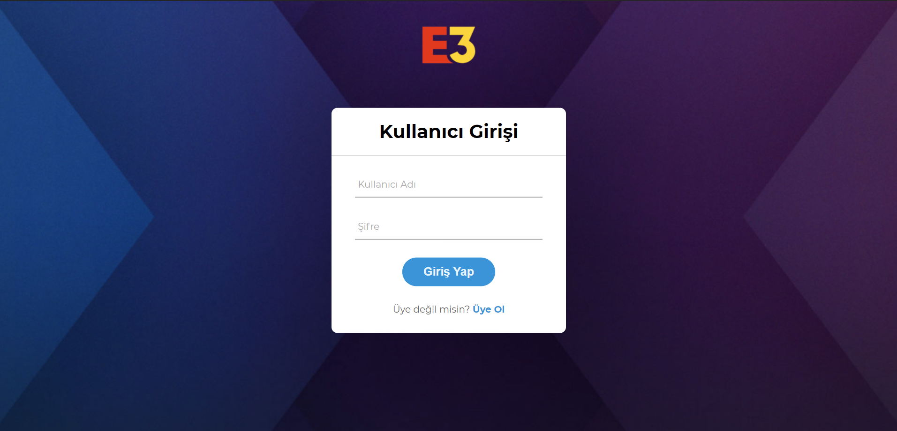
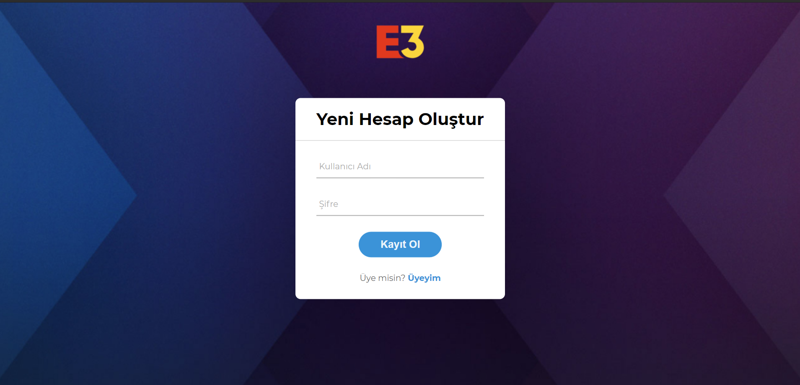
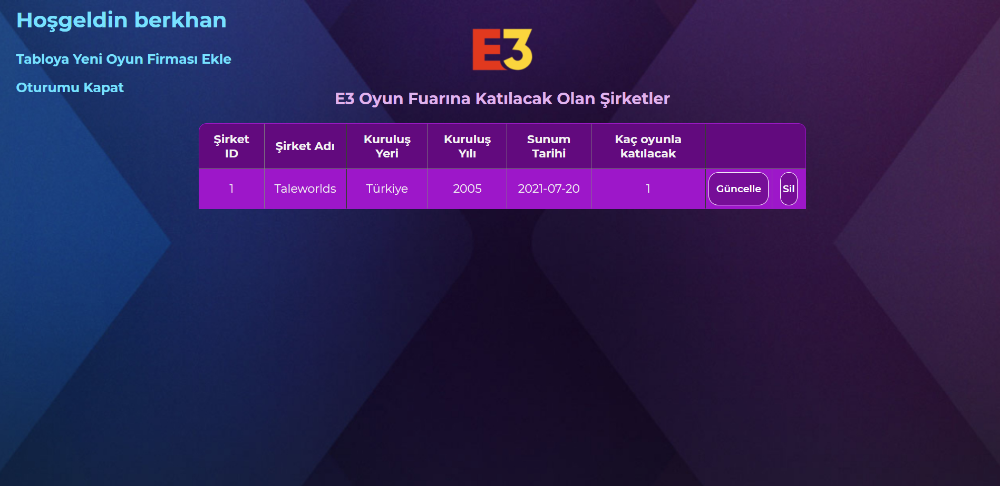
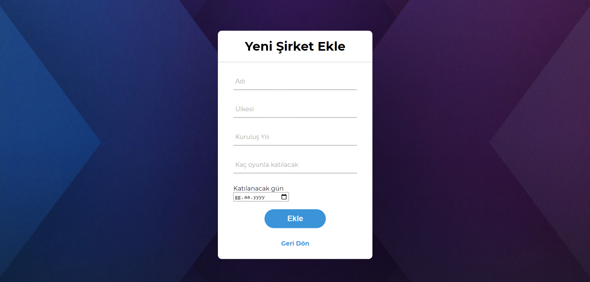
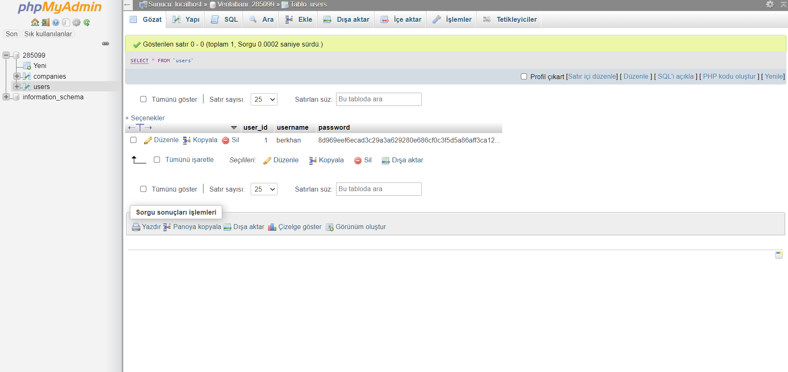
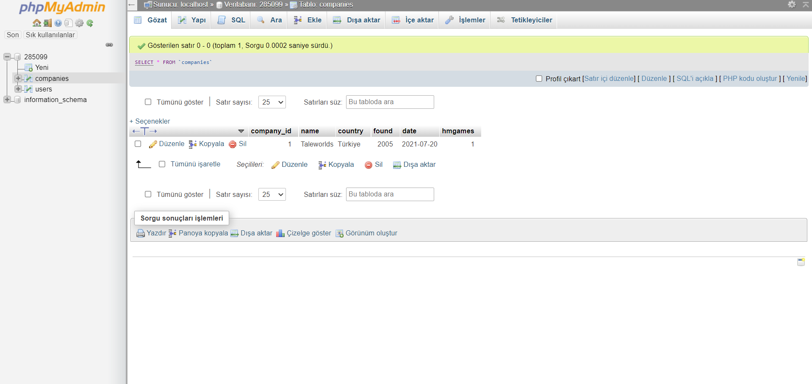

# E3-Otomasyon
Editing(adding, updating, deleting) information of the companies that participated in the E3 Game Conference

# Prerequisites
You need server like Apache. And you need MySQL for database connection. I use XAMPP for this two requisitons. 

# Getting Started
Download project from Github and move to XAMPP/htdocs inside. Write to url area "localhost". Website should be open.

Login

Register

Table

Adding Form

MySQL Users Table

MySQL Companies Table

# Built With

HTML - Substructure
CSS - Style/Design
PHP - Backend
MySQL - Database

# Authors

Berkhan Özen
